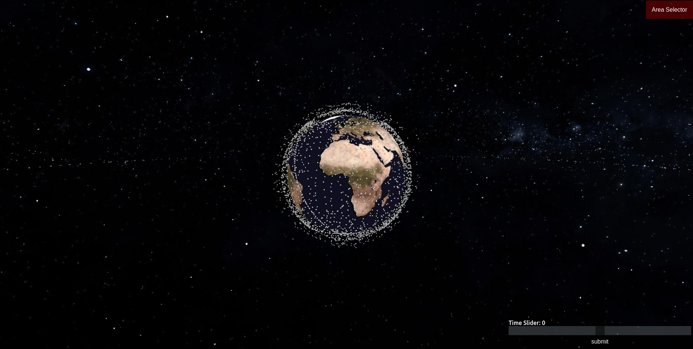
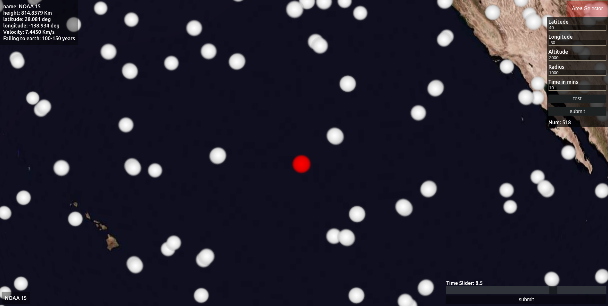
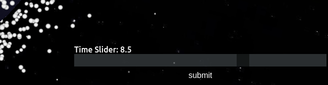
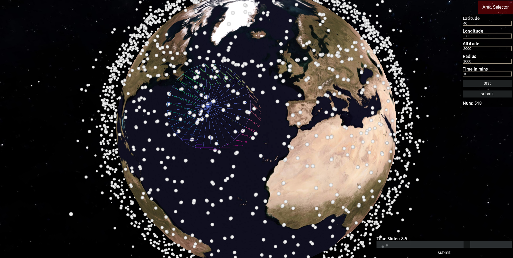

# Mapping-space-trash

## Setup
Download [Node.js](https://nodejs.org/en/download/).
Run this followed commands:

``` bash
# Install dependencies (only the first time)
npm install

# Run the local server at localhost:8080
npm run dev

# Build for production in the dist/ directory
npm run build
```

## Images of the program running
**The start screen**


**Selecting certain object** 


**Selecting Time**


**Selecting Certain volume/area and see how many debris pass in a selected time period**

